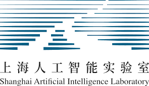








I am currently a Ph.D. student at the [Department of Computer Science and Engineering](https://www.cs.sjtu.edu.cn/) of [Shanghai Jiao Tong University (SJTU)](https://en.sjtu.edu.cn/), advised by Prof. [Dacheng Tao](https://scholar.google.com/citations?user=RwlJNLcAAAAJ&hl=zh-CN&oi=ao) and Prof. [Ya Zhang](https://scholar.google.com/citations?user=pbjw9sMAAAAJ&hl=zh-CN&oi=ao). I received my bachelor's degree from Shanghai Jiao Tong University in June 2022, during which I worked as a research assistant at [ThinkLab](https://thinklab.sjtu.edu.cn/) under the guidance of Prof. [Junchi Yan](https://scholar.google.com/citations?user=ga230VoAAAAJ&hl=zh-CN&oi=ao).

**I am open to potential collaborations. If you are interested, please feel free to contact me via email.**

# 🔎 Research 
My current research interests focus on two key areas:

- **Computer Vision:** autonomous driving, embodied AI
- **Machine Learning:** reinforcement learning, continuous learning

# 🔥 News

<ul style="list-style-type: none; padding-left: 0; margin: 0;">
  <li><em>[Sep. 2025]</em> Two papers are accepted to NeurIPS 2025.</li>
  <li><em>[Sep. 2025]</em> I received an outstanding doctoral student scholarship.</li>
  <li><em>[Aug. 2025]</em> One paper is accepted to SCIS (CCF-A Journal).</li>
  <li><em>[Apr. 2025]</em> One paper is accepted to J-STSP (IEEE Journal of Selected Topics in Signal Processing).</li>
  <li><em>[Feb. 2025]</em> One paper is accepted to SCIS (CCF-A Journal).</li>
  <li><em>[Feb. 2025]</em> One paper is accepted to ICLR 2025 (Oral).</li>
  <li><em>[Jan. 2025]</em> I was selected as Young Talent Support Project Doctoral Special Program (青年人才托举工程博士生专项计划).</li>
  <li><em>[Dec. 2024]</em> One paper is accepted to AAMAS 2025.</li>
  <li><em>[Dec. 2024]</em> I went to NTU for one year of research.</li>
  <li><em>[Nov. 2024]</em> I received the national scholarships of 2024.</li>
  <li><em>[Sep. 2024]</em> One paper is accepted to NeurIPS 2024.</li>
  <li><em>[May. 2024]</em> One paper is accepted to TPAMI.</li>
  <li><em>[May. 2024]</em> Three papers are accepted to ICML 2024.</li>
  <li><em>[Jan. 2024]</em> Our paper about multi-agent communication is accepted to ICLR 2024.</li>
  <li><em>[Jun. 2022]</em> Our paper about autonomouse driving is accepted to ECCV 2022.</li>
</ul>

# 📝 Publications ([Full List](https://scholar.google.com/citations?user=dOsBnNkAAAAJ&hl=zh-CN&oi=ao))

2025

<ul>
    <li>
      Analytic Energy-Guided Policy Optimization for Offline Reinforcement Learning
       Jifeng Hu, Sili Huang, Zhejian Yang, <b>Shengchao Hu</b>, Li Shen, Hechang Chen, Lichao Sun, Yi Chang, Dacheng Tao 
      <i>Neural Information Processing Systems (<b>NeurIPS</b>), <b>CCF-A</b>, 2025</i> 
      [<a href="https://arxiv.org/abs/2505.01822">Paper</a>][<a href="https://charleshsc.github.io/">Code</a>]
    </li>
    <li>
      Tackling Continual Offline RL through Selective Weights Activation on Aligned Spaces
       Jifeng Hu, Sili Huang, Li Shen, Zhejian Yang, <b>Shengchao Hu</b>, Shisong Tang, Hechang Chen, Lichao Sun, Yi Chang, Dacheng Tao 
      <i>Neural Information Processing Systems (<b>NeurIPS</b>), <b>CCF-A</b>, 2025</i> 
      [<a href="https://arxiv.org/abs/2410.15698">Paper</a>][<a href="https://charleshsc.github.io/">Code</a>]
    </li>
    <li>
      Prompt-tuning Decision Transformer with Preference Ranking
       <b>Shengchao Hu</b>, Li Shen, Ya Zhang, Dacheng Tao 
      <i>Science China Information Sciences (<b>SCIS</b>), <b>CCF-A</b>, 2025</i> 
      [<a href="https://arxiv.org/abs/2305.09648">Paper</a>][<a href="https://charleshsc.github.io/">Code</a>]
    </li>
    <li>
      Reconstruct the Pruned Model without Any Retraining
       Pingjie Wang, Ziqing Fan, <b>Shengchao Hu</b>, Zhe Chen, Yanfeng Wang, Yu Wang, 
      <i>IEEE Journal of Selected Topics in Signal Processing (<b>J-STSP</b>), <b>SCI 2</b>, 2025</i> 
      [<a href="https://arxiv.org/abs/2407.13331">Paper</a>][<a href="https://charleshsc.github.io/">Code</a>]
   </li>
    <li>
      Graph decision transformer for offline reinforcement learning
       <b>Shengchao Hu</b>, Li Shen, Ya Zhang, Dacheng Tao, 
      <i>Science China Information Sciences (<b>SCIS</b>), <b>CCF-A</b>, 2025</i> 
      [<a href="https://link.springer.com/article/10.1007/s11432-024-4353-9">Paper</a>][<a href="https://github.com/charleshsc/Graph-DT">Code</a>]
   </li>
    <li>
      Combatting Dimensional Collapse in LLM Pre-Training Data via Diversified File Selection
       Ziqing Fan, Siyuan Du, <b>Shengchao Hu</b>, Pingjie Wang, Li Shen, Ya Zhang, Dacheng Tao, Yanfeng Wang, 
      <i>International Conference on Learning Representations (<b>ICLR</b>), <b>non-CCF, Oral</b>, 2025</i> 
      [<a href="https://arxiv.org/abs/2504.20644">Paper</a>][<a href="https://github.com/MediaBrain-SJTU/DiSF">Code</a>]
   </li>
   <li>
      Prompt Tuning with Diffusion for Few-Shot Pre-trained Policy Generalization
       <b>Shengchao Hu</b>, Wanru Zhao, Weixiong Lin, Li Shen, Ya Zhang, Dacheng Tao, 
      <i>International Conference on Autonomous Agents and Multiagent Systems (<b>AAMAS</b>), <b>CCF-B</b>, 2025</i> 
      [<a href="https://arxiv.org/pdf/2411.01168">Paper</a>][<a href="https://charleshsc.github.io/">Code</a>]
   </li>
</ul>

2024

<ul>
    <li>
      On Transforming Reinforcement Learning by Transformer: The Development Trajectory
       <b>Shengchao Hu</b>, Li Shen, Ya Zhang, Yixin Chen, Dacheng Tao, 
      <i>IEEE Transactions on Pattern Analysis and Machine Intelligence (<b>TPAMI</b>), <b>CCF-A</b>, 2024</i> 
      [<a href="https://ieeexplore.ieee.org/abstract/document/10546317">Paper</a>][<a href="https://charleshsc.github.io/">Code</a>]
    </li>
    <li>
      Is Mamba Compatible with Trajectory Optimization in Offline Reinforcement Learning?
       Yang Dai, Oubo Ma, Longfei Zhang, Xingxing Liang, <b>Shengchao Hu</b>, Mengzhu Wang, Shouling Ji, Jincai Huang, Li Shen, 
      <i>Neural Information Processing Systems (<b>NeurIPS</b>), <b>CCF-A</b>, 2024</i> 
      [<a href="https://arxiv.org/abs/2405.12094">Paper</a>][<a href="https://charleshsc.github.io/">Code</a>]
    </li>
    <li>
      Locally Estimated Global Perturbations is Better than Local Perturbations for Federated Sharpness-aware Minimization
       Ziqing Fan, <b>Shengchao Hu</b>, Jiangchao Yao, Gang Niu, Ya Zhang, Masashi Sugiyama, Yanfeng Wang, 
      <i>International Conference on Machine Learning (<b>ICML</b>), <b>CCF-A, Spotlight</b>, 2024</i> 
      [<a href="https://arxiv.org/abs/2405.18890">Paper</a>][<a href="https://github.com/MediaBrain-SJTU/FedLESAM">Code</a>]
    </li>
    <li>
      HarmoDT: Harmony Multi-Task Decision Transformer for Offline Reinforcement Learning
       <b>Shengchao Hu</b>, Ziqing Fan, Li Shen, Ya Zhang, Yanfeng Wang, Dacheng Tao, 
      <i>International Conference on Machine Learning (<b>ICML</b>), <b>CCF-A</b>, 2024</i> 
      [<a href="https://arxiv.org/abs/2405.18080">Paper</a>][<a href="https://github.com/charleshsc/HarmoDT">Code</a>]
    </li>
    <li>
      Q-value Regularized Transformer for Offline Reinforcement Learning
       <b>Shengchao Hu</b>, Ziqing Fan, Chaoqin Huang, Li Shen, Ya Zhang, Yanfeng Wang, Dacheng Tao, 
      <i>International Conference on Machine Learning (<b>ICML</b>), <b>CCF-A</b>, 2024</i> 
      [<a href="https://arxiv.org/abs/2405.17098">Paper</a>][<a href="https://github.com/charleshsc/QT">Code</a>]
    </li>
    <li>
      Learning Multi-Agent Communication from Graph Modeling Perspective
       <b>Shengchao Hu</b>, Li Shen, Ya Zhang, Dacheng Tao, 
      <i>International Conference on Learning Representations (<b>ICLR</b>), <b>non-CCF</b>, 2024</i> 
      [<a href="https://arxiv.org/abs/2405.08550">Paper</a>][<a href="https://github.com/charleshsc/CommFormer">Code</a>]
    </li>
</ul>

2022

<ul>
   <li>
      St-p3: End-to-end vision-based autonomous driving via spatial-temporal feature learning
       <b>Shengchao Hu</b>, Li Chen, Penghao Wu, Hongyang Li, Junchi Yan, Dacheng Tao, 
      <i>European Conference on Computer Vision (<b>ECCV</b>), <b>CCF-B</b>, 2022</i> 
      [<a href="https://arxiv.org/abs/2207.07601">Paper</a>][<a href="https://github.com/OpenDriveLab/ST-P3">Code</a>]
   </li>
</ul>

# 🎖 Honors and Awards
- *2025.09* 85届计算机系教育发展基金暨杨元庆教育基金优秀博士生奖学金
- *2025.01* Young Talent Support Project Doctoral Special Program (青年人才托举工程博士生专项计划)
- *2024.09* National Scholarships 
- *2020-2021* Shanghai Jiao Tong University Category C Scholarship
- *2018-2022* Zhiyuan Honor Scholarship of Shanghai Jiao Tong University
- *2020.12* Interdisciplinary Contest In Modeling, Honorable Mention
- *2020.12* National Undergraduate Mathematical Modeling Contest in Shanghai Division, Second Prize
- *2019.11* Non-Mathematics Category of Shanghai College Student Mathematics Competition (Higher Education Society Cup), First Prize

# 📖 Educations

  

    

      <strong>2022.09 - Now</strong> 
      PhD, Computer Science, Shanghai Jiao Tong University
    

  

  

    
  

  

    

      <strong>2024.11 - 2025.11</strong> 
      PhD Visiting Student, Computer Science, Nanyang Technological University (NTU)
    

  

  

    
  

  

    

      <strong>2018.09 - 2022.06</strong> 
      Bachelor, Computer Science, Shanghai Jiao Tong University
    

  

  

    
  

# 🎡 Service

  <h3>Conference Committee Member</h3>
  <ul class="service-list">
    <li><a href="https://icml.cc/"><autocolor>International Conference on Machine Learning (ICML)</autocolor></a></li>
    <li><a href="https://iclr.cc/"><autocolor>International Conference on Learning Representations (ICLR)</autocolor></a></li>
    <li><a href="https://neurips.cc/"><autocolor>Neural Information Processing Systems (NeurIPS)</autocolor></a></li>
    <li><a href="http://cvpr2024.thecvf.com/"><autocolor>IEEE/CVF Conference on Computer Vision and Pattern Recognition (CVPR)</autocolor></a></li>
    <li><a href="https://iccv.thecvf.com/"><autocolor>International Conference on Computer Vision (ICCV)</autocolor></a></li>
    <li><a href="https://aaai.org/conference/aaai/aaai-25/"><autocolor>The Association for the Advancement of Artificial Intelligence (AAAI)</autocolor></a></li>
  </ul>

  <h3>Journal Reviewer</h3>
  <ul class="service-list">
    <li><a href="https://cis.ieee.org/publications/t-neural-networks-and-learning-systems"><autocolor>IEEE Transactions on Neural Networks and Learning Systems (TNNLS)</autocolor></a></li>
  <li><a href="https://www.ieee-ras.org/publications/ra-l"><autocolor>IEEE Robotics and Automation Letters (RA-L)</autocolor></a></li>
  </ul>

# 💻 Internships

  

    

      <a href="https://dr.ntu.edu.sg/entities/person/Tao-Dacheng">GenAI Lab</a>, Nanyang Technological University
    

    
Research Assistant, 2024-2025

    
Mentor: Dacheng Tao

  

  

    
  

  

    

      <a href="https://annzhanglion.github.io/">Smart Medical Research</a>, Shanghai AI Lab
    

    
Research Assistant, 2023-2024

    
Mentor: Ya Zhang

  

  

    
  

  

    

      <a href="https://opendrivelab.com/">OpenDriveLab</a>, SenseTime
    

    
Research Intern, 2021-2022

    
Topics: Autonomous Driving

    
Mentor: Hongyang Li

  

  

    
  

  

    

      <a href="https://thinklab.sjtu.edu.cn/">ThinkLab</a>, Shanghai Jiao Tong University
    

    
Research Assistant, 2019-2022

    
Mentor: Junchi Yan

  

  

    
  

	

